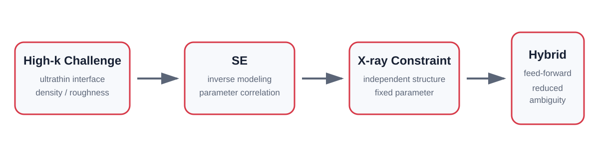
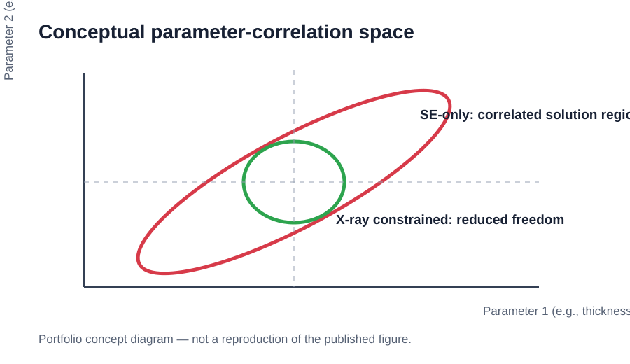
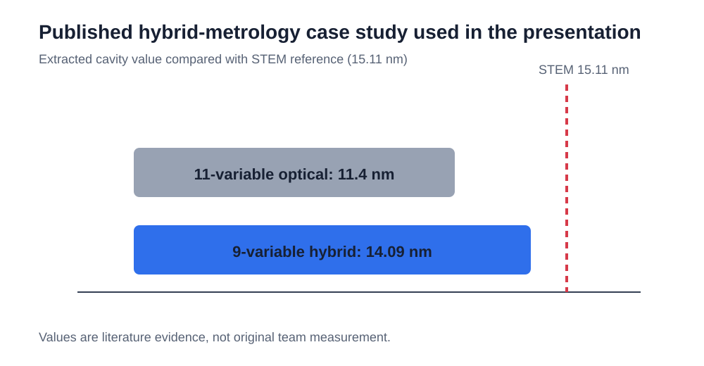

# High-k Thin-Film Characterization with SE–X-ray Hybrid Metrology

2026년 7월 부산 아난티에서 열린 **반도체학술대회 차세대반도체학과 특별세션에서 발표한 팀 프로젝트**입니다.

ALD 기반 High-k 초박막이 수 nm 이하로 얇아질수록 **두께, 밀도, 계면 거칠기, 계면층**이 서로 강하게 결합되어 단일 계측 결과만으로는 고유한 해를 얻기 어려워진다는 문제에서 출발했습니다.

프로젝트에서는 Spectroscopic Ellipsometry(SE)의 역모델링에서 발생하는 parameter correlation을 분석하고, XRR/X-ray 계측으로 얻는 독립적인 구조 정보를 **fixed constraint**로 feed-forward하여 SE 모델의 자유도를 줄이는 **hybrid metrology workflow**를 제안했습니다.

> 이 저장소의 수치 비교는 팀이 직접 장비로 측정한 데이터가 아니라, 발표에서 사용한 **published literature case study**를 정리한 것입니다.

---

## Project at a Glance

| Item | Summary |
|---|---|
| Presentation | 반도체학술대회 차세대반도체학과 특별세션 |
| Date | 2026.07 |
| Venue | 부산 아난티 |
| Target | ALD-based High-k ultrathin films |
| Main problem | SE inverse-model parameter correlation |
| Structural metrology | XRR / X-ray based measurement |
| Optical metrology | Spectroscopic Ellipsometry |
| Proposed strategy | X-ray data → fixed constraints → SE inverse modeling |
| Key target properties | Thickness, density, interface/surface roughness |
| My main section | Hybrid integration, feed-forward modeling, literature case-study interpretation |



---

## Problem Definition

At advanced nodes, High-k films and their interfacial layers become thin enough that average film properties are no longer sufficient.

The project focused on three metrology challenges:

1. **ALD initial growth is not perfectly uniform.**  
   Early island-like growth can leave vertical density non-uniformity and void-like regions.

2. **A thin SiOₓ interfacial layer can form between High-k and Si.**  
   This can influence the effective dielectric behavior of the whole gate stack.

3. **SE becomes mathematically ambiguous in the ultrathin regime.**  
   Thickness, refractive index, and roughness can generate similar optical responses, so the inverse problem may not have a unique solution.

The 2024 IRDS metrology roadmap was used in the project to motivate why advanced thin-dielectric metrology still requires further research.

---

## Why SE Alone Is Not Enough

SE measures polarization changes and solves an **inverse-modeling problem**.

Measured optical data are compared with a virtual multilayer model, and the model parameters are adjusted to minimize error such as MSE.

The challenge is that for an ultrathin film:

- increasing thickness can change the optical response,
- increasing refractive index can produce a similar response,
- changing roughness can also alter the modeled response.

This produces a **parameter-correlation / ill-posed problem**: a low fitting error does not automatically guarantee that the extracted physical structure is correct.



---

## Role of X-ray Metrology

The project reviewed XRD and XRR as complementary X-ray techniques.

### XRR

XRR can provide structural information such as:

- film thickness
- electron-density-related film density
- interface/surface roughness

However, the project also noted that XRR itself becomes difficult when films approach the ~1 nm scale because Kiessig fringes become weak or disappear.

### XRD / HRXRD

For periodic crystalline multilayer structures, XRD/HRXRD peak spacing can independently constrain structural thickness.

This was important in the literature case study used by the team to explain the general **feed-forward hybrid-metrology** concept.

---

## Proposed Hybrid Workflow

```text
X-ray measurement
       ↓
Independent structural parameters
(thickness / density / roughness depending on technique)
       ↓
Feed-forward as fixed constraints
       ↓
SE optical inverse model
       ↓
Reduced parameter freedom and correlation
       ↓
More physically interpretable solution
```

The key idea is not simply to combine two instruments.

It is to use **independent X-ray-derived physical information as a mathematical constraint** inside the SE inverse model.

---

## Literature Case Study Used in the Presentation

The final presentation used a 2025 Journal of Applied Physics paper on hybrid optical/X-ray metrology as a quantitative example of why physical constraints matter.

| Model | Floating parameters | MSE | Extracted cavity value | STEM reference |
|---|---:|---:|---:|---:|
| Unconstrained optical model | 11 | 0.163084 | 11.4 nm | 15.11 nm |
| X-ray-constrained hybrid model | 9 | 0.428461 | 14.09 nm | 15.11 nm |

The important observation is that the model with the **lower MSE was not the model closest to the physical reference**.

This case study was used to illustrate that fitting quality alone cannot resolve parameter ambiguity, and that independent physical constraints can improve the physical validity of an inverse solution.

> The cited experiment was not an ALD High-k measurement performed by our team. It was used as a literature-based validation example for the hybrid-metrology strategy.



---

## My Contribution

My main assigned section was **SE + X-ray hybrid analysis**.

I organized and presented the logic from the single-technique limitations to the integrated solution:

- interpretation of parameter-correlation ambiguity
- explanation of the feed-forward fixed-constraint concept
- connection between X-ray structural information and SE inverse modeling
- interpretation of floating vs fixed parameter models
- comparison of literature case-study values with the STEM reference
- explanation of why a lower MSE can still correspond to a physically wrong solution
- final interpretation for High-k thin-film density / roughness characterization

See [My Contribution](./guide/06_my_contribution.md) for the detailed boundary of my work.

---

## Read the Project

| Page | Description |
|---|---|
| [Project Page](./index.html) | 프로젝트 전체 흐름 |
| [Navigation](./guide/00_navigation.md) | 전체 문서 안내 |
| [Project Overview](./guide/01_project_overview.md) | 문제 정의와 연구 흐름 |
| [High-k Metrology Challenge](./guide/02_highk_metrology_challenge.md) | ALD 초기 성장·계면·밀도 문제 |
| [SE Principle & Limit](./guide/03_se_inverse_modeling.md) | SE 역모델링과 parameter correlation |
| [X-ray Metrology](./guide/04_xray_metrology.md) | XRD/XRR 역할과 단독 한계 |
| [Hybrid Workflow](./guide/05_hybrid_feedforward.md) | X-ray constraint → SE feed-forward |
| [My Contribution](./guide/06_my_contribution.md) | 주수빈 담당 내용 |
| [Literature Case Study](./guide/07_literature_case_study.md) | 11-variable vs 9-variable example |
| [Application to High-k](./guide/08_highk_application.md) | High-k 분석에 대한 프로젝트 제안 |
| [Limitations](./guide/09_limitations_and_lessons.md) | 직접 실험 여부와 적용 범위 |
| [References](./references/README.md) | 발표·보고서 기반 참고문헌 |
| [Evidence Scope](./report/README.md) | 원본 제출 자료와 공개 범위 |

---

## Repository Structure

```text
High-k-SE-Xray-Hybrid-Metrology/
├── README.md
├── index.html
├── index.md
├── _config.yml
├── assets/
├── figures/
├── guide/
├── results/
├── study/
├── references/
├── appendix/
├── source/
└── report/
```

---

## Scope

This project is a **literature-based semiconductor metrology study and analysis proposal**, not a report of original wafer measurements.

The repository therefore separates:

- concepts proposed by the team,
- published values used as supporting case studies,
- and my individual presentation/analysis contribution.

No original experimental data are claimed where the submitted project materials do not support such a claim.
